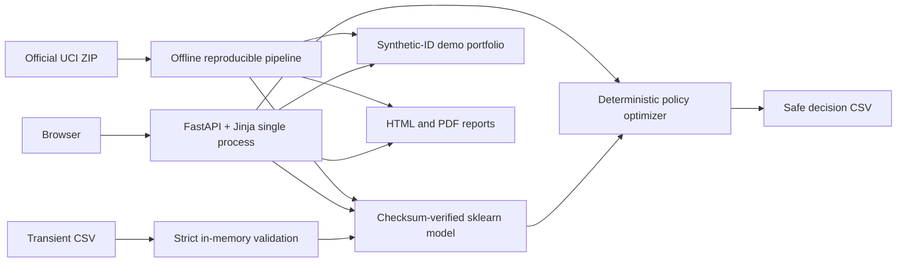

# LimitIQ

Dynamic credit-line management and exposure optimization for an existing card
portfolio. LimitIQ turns calibrated default risk into governed +10%, +20%, +30%,
no-change, manual-review or early-warning freeze actions—then explains the
portfolio, account, policy, financial and governance trade-offs in one working
banking product.

> **Educational-use disclaimer:** LimitIQ is an educational portfolio
> demonstration using public and synthetic data. It is not a production
> credit-decision system and must not be used to make real lending decisions.

## Product evidence


The public deployment link is added only after its HTTPS health and production
workflows have been verified. The repository remains fully runnable locally in
the meantime.

## What it delivers

- Executive exposure, loss, simulated contribution, return, risk and action view
- Searchable/filterable/paginated portfolio with safe filtered CSV download
- Synthetic-ID account decision with PD/ECL/value, reasons, checks and history
- Adjustable policy/economics simulator with baseline deltas and action mix
- Strict transient CSV batch scoring and downloadable decisions
- Baseline/champion, calibration, confusion, feature, band and fairness evidence
- Executive HTML/PDF plus quality, EDA, model, policy and financial reports

## Evidence boundary

| Layer | What LimitIQ uses | What it means |
|---|---|---|
| Observed | UCI limits, six monthly status/bill/payment fields, default target | Historical Taiwan source data |
| Model-estimated | Calibrated PD and risk band | Out-of-sample statistical estimate |
| Simulated | Response, EAD/LGD, revenue/cost, contribution, proposed line | Transparent scenario—not causal or realized impact |

The source contains no observed response to a line increase. Baseline PD is held
constant across candidates; ECL changes through EAD. No simulated profit or
uplift is presented as observed production impact.

## Dataset

Selected: **Default of Credit Card Clients**, I-Cheng Yeh / UCI Machine Learning
Repository, 30,000 Taiwan accounts, April–September 2005 behavior and
subsequent-month default target. DOI: https://doi.org/10.24432/C55S3H. Licence:
CC BY 4.0. The pipeline downloads the official source, validates it and records
SHA-256 `30c6be3abd8d…`.

Four candidates and the selection rationale are documented in
[docs/DATASET_CANDIDATES.md](docs/DATASET_CANDIDATES.md). Original IDs and
demographics are absent from the committed demonstration portfolio.

## Model methodology and exact test evidence

Fixed stratified split: 18,000 train / 6,000 validation / 6,000 untouched test.
An in-pipeline feature builder feeds sigmoid-calibrated regularized logistic
regression and histogram gradient boosting. Selection minimizes validation Brier
among models within 0.02 ROC-AUC of the best; a cost-weighted threshold is frozen
before one untouched-test read.

Champion: **calibrated histogram gradient boosting**. Untouched-test ROC-AUC
0.781082, PR-AUC 0.568754, Brier 0.133120, log loss 0.426325, precision 0.360506,
recall 0.773173 and F1 0.491733 at threshold 0.149099. Model artifact SHA-256:
`4a84b86c3f7f0fa4cc74a9e1a9140192313719712d3df5ee865e1dfd2eacff96`.

## Simulated business result

Under the documented default assumptions, the 6,000-account test scenario
selects 1,904 +30% increases, 2,434 no-change actions, 546 manual reviews and
1,116 freezes. Proposed lines increase from TWD 1.011790B to TWD 1.096231B;
simulated expected loss increases from TWD 101.772M to TWD 105.872M; simulated
annual incremental contribution is TWD 13.926M and simulated contribution /
incremental EAD is 21.95%. **These are deterministic scenario outputs, not
causal estimates, forecasts or realized business impact.**

## Architecture



One Python process; no SPA, database service, feature store, LLM, paid API or
runtime network dependency. The model checksum is verified before trusted
joblib loading. Uploads are bounded CSV only and are never retained.

## Setup

Python 3.12 is required.

```bash
python -m venv .venv
# Linux/macOS: source .venv/bin/activate
# Windows PowerShell: .venv\Scripts\Activate.ps1
python -m pip install -r requirements-dev.txt
```

The committed artifacts let the app start immediately:

```bash
python -m uvicorn limitiq.web:app --host 127.0.0.1 --port 8000
```

Open http://127.0.0.1:8000. Health: http://127.0.0.1:8000/health.

## Reproducible commands

```bash
# Fresh official download, cleaning, training, untouched-test evaluation and reports
python -m limitiq.pipeline all

# Retrain from the already-downloaded source
python -m limitiq.pipeline train

# Regenerate report files from versioned evidence
python -m limitiq.pipeline reports

# Unit and integration checks
python -m pytest

# Lint and formatting contract
ruff check . && ruff format --check .

# Production container
docker build -t limitiq . && docker run --rm -p 8000:8000 limitiq
```

The raw XLS and cleaned 30,000-row duplicate are intentionally gitignored. The
small reproducible champion (204 KB), synthetic-ID demo portfolio (about 3.3 MB)
and evidence reports are committed so fresh-clone deployment never trains.

## Security and privacy

Strict upload schema/range/type/duplicate validation; 5 MB / 5,000-row caps;
in-memory, no-retention processing; formula-safe CSV exports; allowlisted sorts
and report paths; Jinja autoescape; safe production errors; CSP, frame denial,
nosniff, referrer/permissions/opener headers; non-root one-worker image; no
debug, source secrets, personal data or uploaded deserialization.

## Documentation and reports

- [Executive PDF](reports/executive_report.pdf) and [HTML](reports/executive_report.html)
- [Methodology](docs/METHODOLOGY.md), [PRD](docs/PRD.md), [architecture](docs/ARCHITECTURE.md)
- [Data card](docs/DATA_CARD.md), [model card](docs/MODEL_CARD.md), [dictionary](docs/DATA_DICTIONARY.md)
- [Assumptions](docs/ASSUMPTIONS.md), [case study](docs/CASE_STUDY.md), [five-minute walkthrough](docs/INTERVIEW_WALKTHROUGH.md)
- [Deployment runbook](docs/DEPLOYMENT.md), [dataset attribution](NOTICE.md)
- Generated [quality](reports/data_quality_report.html), [EDA](reports/eda_report.html), [model](reports/model_performance_report.html), [policy](reports/policy_simulation_report.html) and [financial](reports/financial_impact_analysis.html) reports

## Limitations and roadmap

The source is old, single-market and lacks income/assets, external obligations,
macro scenarios, observed EAD/LGD, line treatments, response or profit. Segment
diagnostics cannot prove fair-lending compliance. The displayed management ECL
is neither an IFRS 9 provision nor a regulatory-capital calculation. U.S.
production use requires a governed Regulation Z ability-to-pay assessment.

Roadmap: current multi-market behavioral data; verified affordability inputs;
randomized line experiments and causal response; empirically estimated LGD/CCF/
costs; independent model/legal validation; controlled overrides; shadow mode;
small monitored pilot; outcome/calibration/drift monitoring and rollback.

## Licence

Code: [MIT](LICENSE). Dataset: CC BY 4.0 with attribution in [NOTICE.md](NOTICE.md).

