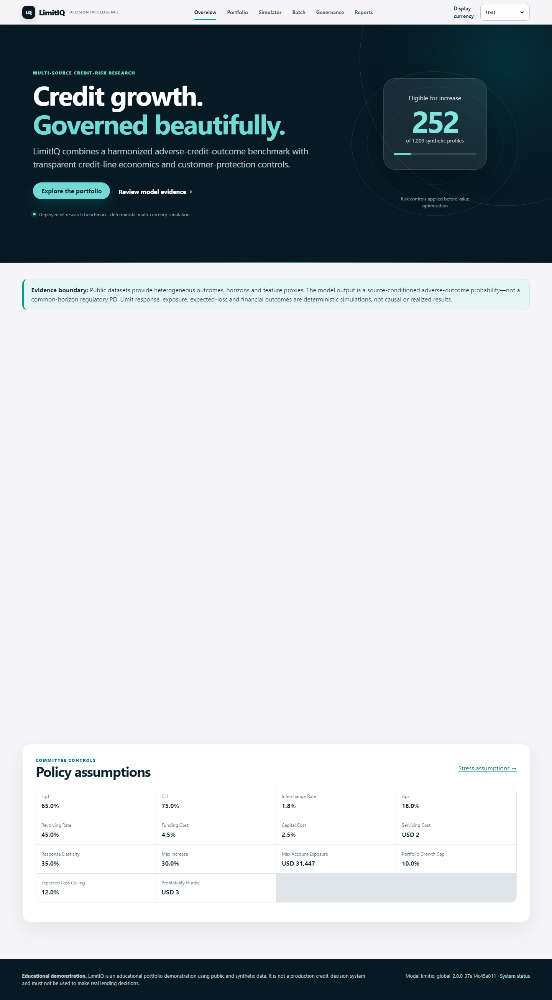
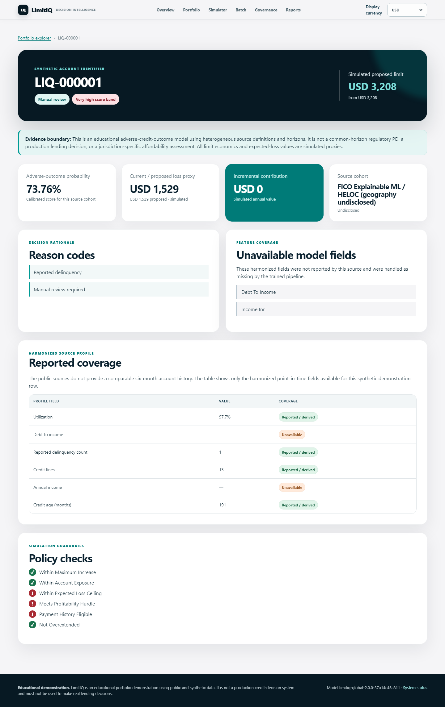
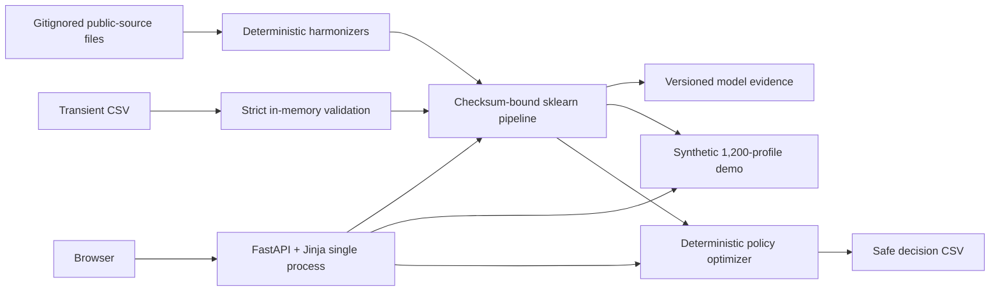

# LimitIQ

Dynamic credit-line management and exposure optimization for an existing credit
portfolio. LimitIQ combines calibrated risk estimates with governed +10%, +20%,
+30%, no-change, manual-review and early-warning-freeze actions, then explains
the portfolio, account, financial and governance trade-offs in one working
banking product.

> **Educational-use disclaimer:** LimitIQ is an educational portfolio
> demonstration using public and synthetic data. It is not a production
> credit-decision system and must not be used to make real lending decisions.

## Release status

- **Live public deployment — v2.0.0** (12 August 2026): multi-source global
  benchmark trained on 1,869,548 harmonized rows across six independent cohorts,
  deployed via tag `v2.0.0` from commit `7e4ca6e` after green GitHub Actions CI
  (including Docker container health check). The public URL and `/health`
  endpoint below serve this version.
- **Superseded v1:** Taiwan-only 30,000-row model, still verifiable via tag
  `v1.0.0` and Git history. V1 evidence is intentionally kept separate from v2.
- **Source terms:** the four non-UCI upstream platforms (Give Me Some Credit,
  FICO/HELOC, Lending Club, Home Credit) remain under license review for future
  releases; the owner's 12 August 2026 review and decision are recorded in
  [`NOTICE.md`](NOTICE.md).

## Product evidence





**Live v2.0.0 demo:** https://limitiq-credit-line-optimization.onrender.com

**Live v2.0.0 health:** https://limitiq-credit-line-optimization.onrender.com/health
(reports application `2.0.0`, model `limitiq-global-2.0.0-37a14c45a811`,
dataset `global-7-94bb4c0ad0f1`)

The free Render service may need about 50 seconds to wake after inactivity.

## What it delivers

- Executive exposure, loss, simulated contribution, return, risk and action view
- Searchable/filterable/paginated portfolio with safe filtered CSV download
- Synthetic-ID account decision with risk, loss proxy, value, reasons and checks
- Adjustable policy/economics simulator with baseline deltas and action mix
- Strict transient CSV batch scoring and downloadable decisions
- Baseline/champion, calibration, confusion, feature, band and governance evidence
- Executive HTML/PDF plus quality, model, policy and financial reports
- Multi-currency display toggle (USD default, INR, EUR) with documented fixed
  presentation rates; INR remains the canonical internal currency

## Evidence boundary

| Layer | What LimitIQ uses | What it means |
|---|---|---|
| Observed | Source-specific behavior and adverse-outcome labels | Historical source data with different products, periods, events and horizons |
| Model-estimated | Calibrated adverse-outcome probability and risk band | Within-source statistical interpolation; not a common-horizon regulatory PD |
| Simulated | Response, EAD/LGD, revenue/cost, contribution and proposed line | Transparent scenario—not causal or realized impact |

No source contains observed response to a line increase. Baseline risk is held
constant across candidates and expected loss changes through simulated EAD. No
simulated uplift or profit is presented as observed production impact.

For India-focused presentation, only source-disclosed currencies are converted
to INR at documented fixed rates. FX localization does not make a historical
population Indian or make cross-source amounts economically equivalent.

The live app can present the canonical INR portfolio in USD (default), INR or
EUR via a display toggle; these are fixed presentation rates (reference date
31 July 2026, 95.4 INR/USD, 110 INR/EUR) and never alter model scores, loss
proxies or the batch schema, which stay INR-canonical.

## Data

### Verified deployed v1

V1 uses **Default of Credit Card Clients**, I-Cheng Yeh / UCI Machine Learning
Repository: 30,000 Taiwan accounts, April–September 2005 behavior and a
subsequent-month default target. DOI: https://doi.org/10.24432/C55S3H. Licence:
CC BY 4.0. The source SHA-256 begins `30c6be3abd8d`.

Source TWD limits, bills and payments are converted before modelling to INR at a
fixed ₹2.97 per TWD, derived from documented July 2026 USD reference rates. This
is a deterministic presentation transform, not Indian borrower evidence.

### Deployed v2 benchmark

V2 trains on six independent cohorts: Taiwan Credit, corrected South German
Credit, Give Me Some Credit, cleaned FICO/HELOC, Lending Club accepted loans and
Home Credit application data. Legacy Statlog German is reference-only because it
represents the same 1,000-credit population as corrected South German.

The training union contains 1,869,548 rows; Lending Club and Home Credit each
contribute more than 200,000. Labels include next-month default, two-year serious
delinquency, historical good/bad credit, status at extract and payment
difficulty. They are not collapsed into a fictional common-horizon PD.

Geography and currency are undisclosed for Give Me Some Credit and Home Credit.
Home Credit monetary fields are not converted or presented as INR. Complete
source, mirror, checksum and terms evidence is in [NOTICE.md](NOTICE.md) and the
[data card](docs/DATA_CARD.md).

## Model methodology and exact test evidence

### Verified deployed v1

Fixed stratified split: 18,000 train / 6,000 validation / 6,000 untouched test.
An in-pipeline feature builder feeds sigmoid-calibrated regularized logistic
regression and histogram gradient boosting. The champion is calibrated histogram
gradient boosting. Untouched-test ROC-AUC is 0.781138, PR-AUC 0.567889, Brier
0.133149 and log loss 0.426351 at threshold 0.173874. Model SHA-256:
`284f9a7c8ca22ea2f8091dfea814796357f81014cfdbabecf62b7aaa0de14275`.

### Deployed v2 benchmark

The v2 champion is sigmoid-calibrated histogram gradient boosting, selected
against a calibrated regularized-logistic baseline using source-macro validation
evidence. Model version: `limitiq-global-2.0.0-37a14c45a811`; threshold:
`0.16891891891891891`.

| Metric | Source-macro test | Pooled row-weighted test |
|---|---:|---:|
| ROC-AUC | 0.684530 | 0.669891 |
| PR-AUC | 0.402370 | 0.304965 |
| Brier score | 0.138968 | 0.140629 |
| Log loss | 0.433385 | 0.444856 |
| Mean absolute calibration-bin gap | 0.026968 | See versioned evidence |

Macro evidence is primary. Pooled evidence is secondary because Lending Club
supplies 1,371,166 rows. The seeded random split tests interpolation within each
source; it does not establish unseen-country, future-vintage,
leave-one-source-out or Indian-population generalization. Region is one-hot
encoded, and region plus structural missingness may identify source and base rate.

## Simulated business results

### Verified deployed v1

Under documented assumptions, the 6,000-account scenario selects 1,904 +30%
increases, 2,434 no-change actions, 546 manual reviews and 1,116 freezes.
Proposed lines increase from ₹3.005016B to ₹3.255868B; simulated expected loss
increases from ₹302.466M to ₹314.697M; simulated annual incremental contribution
is ₹41.343M and simulated contribution / incremental EAD is 21.93%.

### Local v2 synthetic demo — not deployed

The deterministic 1,200-profile synthetic demonstration produces ₹567.613M
current and ₹608.791M proposed credit limits, ₹500.023M current and ₹530.935M
proposed exposure proxy, ₹75.984M current and ₹77.625M proposed expected-loss
proxy, ₹6.412M simulated incremental contribution and 20.74% simulated
contribution / incremental exposure. It routes 18 profiles to +10%, 18 to +20%,
216 to +30%, 283 to no change, 619 to manual review and 46 to freeze automatic
increases.

All values in both sections are simulated scenario outputs—not source
observations, causal forecasts, realized impact, IFRS 9 ECL or regulatory capital.

## Architecture



One Python process; no SPA, database service, feature store, LLM, paid API or
runtime network dependency. The model checksum is verified before trusted
joblib loading. Uploads are bounded CSV only and are never retained.

## Setup

Python 3.11 is the tested local, CI and Docker version. The package contract is
Python `>=3.11,<3.14`.

```bash
python -m venv .venv
# Linux/macOS: source .venv/bin/activate
# Windows PowerShell: .venv\Scripts\Activate.ps1
python -m pip install -r requirements-dev.txt
```

Start the application from the prepared artifacts:

```bash
python -m uvicorn limitiq.web:app --host 127.0.0.1 --port 8000
```

Open http://127.0.0.1:8000. Health: http://127.0.0.1:8000/health.

## Reproducible commands

```bash
# V1 official-source rebuild
python -m limitiq.pipeline all

# Local v2 rebuild from already-downloaded, gitignored raw files
python -m limitiq.multisource

# External cross-dataset validation of the v1 modelling recipe
python -m limitiq.external

# Unit and integration checks
python -m pytest

# Lint and formatting contract
ruff check . && ruff format --check .

# Production container
docker build -t limitiq . && docker run --rm -p 8000:8000 limitiq
```

Raw sources, environments and caches are intentionally gitignored. V2 is
published per the owner's 12 August 2026 terms decision recorded in
[`NOTICE.md`](NOTICE.md); several upstream/competition source terms remain
under review for future releases.

## Security and privacy

Strict upload schema/range/type/duplicate validation; 5 MB / 5,000-row caps;
in-memory no-retention processing; formula-safe CSV exports; allowlisted sorts
and report paths; Jinja autoescape; safe production errors; CSP, frame denial,
nosniff, referrer/permissions/opener headers; non-root one-worker image; no
debug, source secrets, personal data or uploaded deserialization.

## Documentation and reports

- [Executive PDF](reports/executive_report.pdf) and [HTML](reports/executive_report.html)
- [v2 model evidence](reports/global_model_report.html)
- [v2 executive PDF](reports/global_executive_report.pdf) and [HTML](reports/global_executive_report.html)
- [v2 policy sensitivity](reports/global_policy_simulation_report.html)
- [v2 financial-impact analysis](reports/global_financial_impact_analysis.html)
- [Methodology](docs/METHODOLOGY.md), [PRD](docs/PRD.md), [architecture](docs/ARCHITECTURE.md)
- [Data card](docs/DATA_CARD.md), [model card](docs/MODEL_CARD.md), [dictionary](docs/DATA_DICTIONARY.md)
- [Assumptions](docs/ASSUMPTIONS.md), [case study](docs/CASE_STUDY.md), [five-minute walkthrough](docs/INTERVIEW_WALKTHROUGH.md)
- [Career targeting guide](docs/CAREER_TARGETING.md) for India-based risk, analytics, model-governance and risk-technology roles
- [Deployment runbook](docs/DEPLOYMENT.md), [dataset attribution and terms](NOTICE.md)
- [Verified v1 and deployed v2 QA evidence](docs/QA_REPORT.md)

## Limitations and roadmap

V1 is old and single-market. V2 adds scale and source diversity but combines
different products, sampling frames, event definitions and horizons. Its random
within-source split is not an out-of-time or unseen-market test; Lending Club
dominates pooled metrics; region and missingness can reveal source; and several
source terms remain unresolved. Both versions lack verified production
affordability, macro scenarios, observed line treatments, causal response and
profit economics. Segment diagnostics cannot prove fair-lending compliance.

Roadmap: clear source terms; add current, terms-cleared multi-market behavior;
perform leave-one-source-out and out-of-time evaluation; assess source-balanced
training; add verified affordability inputs and causal line experiments;
independent model/legal validation; shadow mode, monitored pilot and rollback.

SBA loan data and Polish Companies Bankruptcy are separate-validation research
candidates. PAKDD 2009 and Freddie/Fannie data are not accepted into the public
union because source/terms/access or product-fit requirements are not satisfied.

## Career positioning

For J.P. Morgan, UBS, Morgan Stanley and State Street, lead with model
governance, provenance, calibration, portfolio controls and production-shaped
risk technology. Never imply that an employer endorsed, reviewed or uses
LimitIQ. See the [career guide](docs/CAREER_TARGETING.md).

## Licence

Code: [MIT](LICENSE). Dataset terms differ by source; attribution and the blocked
v2 publication gate are recorded in [NOTICE.md](NOTICE.md). MIT does not
relicense third-party data or derived-artifact rights.
