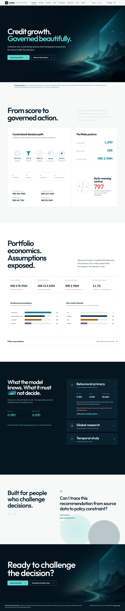
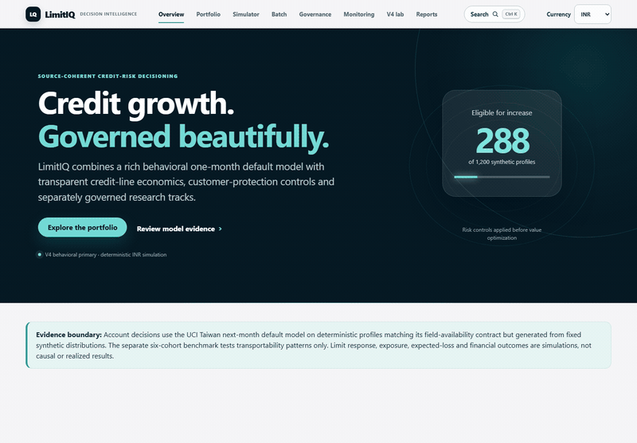
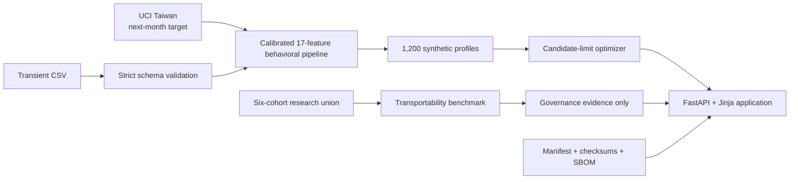

# LimitIQ

[](https://limitiq-credit-line-optimization.onrender.com)
[](https://github.com/Ghostboy789/limitiq-credit-line-optimization/actions/workflows/ci.yml)
[](https://github.com/Ghostboy789/limitiq-credit-line-optimization/actions/workflows/codeql.yml)
[](https://github.com/Ghostboy789/limitiq-credit-line-optimization/actions/workflows/uptime.yml)
[](https://github.com/Ghostboy789/limitiq-credit-line-optimization/releases/latest)
[](LICENSE)

**Governed credit-line decision support: coherent risk, constrained actions, transparent economics.**

LimitIQ evaluates +10%, +20%, +30%, hold, manual-review and early-warning-freeze
actions for existing credit-card customers. It combines a calibrated next-month
default model, deterministic candidate-limit optimization, customer-protection
rules and a recruiter-ready banking workflow in one Dockerized FastAPI service.

> LimitIQ is an educational portfolio demonstration using public and synthetic
> data. It is not a production credit-decision system and must not be used to
> make real lending decisions.

## Review this project in five minutes

1. [Executive overview](https://limitiq-credit-line-optimization.onrender.com/) — portfolio posture and simulated economics.
2. [Portfolio explorer](https://limitiq-credit-line-optimization.onrender.com/portfolio) — filters, reason codes and account traceability.
3. [Policy simulator](https://limitiq-credit-line-optimization.onrender.com/simulator) — baseline-versus-scenario trade-offs.
4. [Model governance](https://limitiq-credit-line-optimization.onrender.com/governance) — primary evidence, independent challenge and research benchmark.
5. [Recruiter brief](docs/RECRUITER_BRIEF.md) — interview narrative, résumé bullets and role fit.
6. [V4.2 model-improvement evidence](docs/MODEL_IMPROVEMENT_EVIDENCE.md) — calibration challenge, vintage sensitivity, support routing and India/pilot gates.

## Product preview



[Tablet at 768 px](docs/assets/v5-overview-tablet.webp) ·
[Mobile at 390 px](docs/assets/v5-overview-mobile.webp)

The current overview uses self-hosted Outfit typography, a locally served pinned
GSAP runtime, native disclosure controls and reduced-motion fallbacks. The
captured values come from the same server-rendered observed, model-estimated and
explicitly simulated evidence fields as the rest of the application.



[Portfolio explorer](docs/assets/v4-portfolio.png) ·
[Account decision](docs/assets/v4-account.png) ·
[Policy simulator](docs/assets/v4-simulator.png) ·
[Governance verdict](docs/assets/v4-governance.png)

The overview captures show the current interface and synthetic demonstration
data. The workflow capture and linked secondary-route images record the verified
v4 release; the linked public service remains authoritative.

The **v4.2.0 implementation boundary is verified** at
`6a99d80c2e1eb576b60834c825efc919304f87c0`. Render `/health`, GitHub CI and
CodeQL agreed on that exact commit, application `4.2.0`, model
`limitiq-behavioral-4.0.0-21234ab33f78` and dataset
`uci-350-behavioral-6ba3a746be13`. The immutable v4.2.0 tag identifies the final
release-evidence boundary after that documentation-only commit repeats the same
gates.

The verified v4.2 suite passes **161 tests**. Its default scoped
3,210-statement report is **76.07%**; the separately printed all-`limitiq`
3,756-statement denominator, including both offline research CLIs, is
**67.60%**. The deployed-model producer `behavioral.py` is **70.94%** covered.

## The senior-level design decision

V4 keeps the two-track boundary introduced in v3 and adds a separate temporal
loan study:

| Track | Purpose | Data and target | Decision use |
|---|---|---|---|
| **Primary** | Source-coherent behavioral application model | UCI Taiwan, 30,000 accounts, default in the following month | Drives only the educational synthetic demo |
| **Research** | Cross-source transportability benchmark | 1,869,548 rows, six independent cohorts with different events and horizons | Governance evidence only; never drives account recommendations |
| **Vintage study** | Vintage-ordered and stressed-segment sensitivity research | 400,000 seasoned US installment loans; matured terminal 36-month outcomes | Never feeds card recommendations; not a point-in-time backtest |

This avoids pretending that heterogeneous public labels form one regulatory PD.
The primary model still does **not** establish Indian-market, out-of-time,
production, regulatory or fair-lending suitability.

V4.2 adds a development-only four-candidate calibration challenge, conservative
out-of-support manual-review routing, vintage-ordered sensitivity/stress evidence,
segment monitoring, an observed randomized-pilot analyzer and a strict Indian
account-month forward-validation runner. It publishes the weak high-utilization
calibration segment and caps that segment at +10%. It deliberately leaves the
checksum-bound v4 primary unchanged until a genuinely new validation population exists.

## Exact primary-model evidence

Model: `limitiq-behavioral-4.0.0-21234ab33f78`

Champion: sigmoid-calibrated histogram gradient boosting

Split: 18,000 train / 6,000 validation / 6,000 untouched test

Active fields: 17 engineered measures from six months of limits, repayment
status, bills and payments; customer ID and protected attributes excluded

| Untouched-test metric | Result | Seeded 95% bootstrap interval |
|---|---:|---:|
| ROC-AUC | **0.781138** | 0.767398–0.796055 |
| PR-AUC | **0.567889** | 0.540125–0.599004 |
| Brier score | **0.133149** | 0.127508–0.138953 |
| Log loss | **0.426351** | 0.412325–0.441232 |

Threshold `0.173874` was frozen from validation data before the single test-set
evaluation. The random within-source split is interpolation evidence, not a
future-vintage study.

Against the frozen v3 two-feature model on those same 6,000 accounts, v4 gains
`0.023728` ROC-AUC (paired 95% interval `0.017680–0.030144`) and reduces Brier
score by `0.008533` (`0.006640–0.010342` improvement). These are measured
within-source model results, not production impact.

The separate global research benchmark records source-macro ROC-AUC `0.684530`,
PR-AUC `0.402370`, Brier `0.138968` and log loss `0.433385`. Pooled results are
secondary because Lending Club dominates the row count and source outcomes are
not equivalent.

## Simulated portfolio outcome

The v4 demo contains 1,200 deterministic **synthetic six-month histories**. No
public source row or personal identifier is exposed.
Synthetic annual income and monthly obligations produce a clearly labelled FOIR
proxy; they are demonstration assumptions, not verified ability-to-pay data.

| Scenario result | Simulated value |
|---|---:|
| Risk-adjusted return on incremental exposure | **6.25%** |
| Contribution per eligible account | **₹2,342** |
| Incremental expected loss / gross contribution | **32.29%** |
| Current / proposed limits | ₹478.947M / ₹488.029M |
| Current / proposed exposure proxy | ₹428.861M / ₹436.129M |
| Current / proposed loss proxy | ₹53.247M / ₹53.723M |
| +10% / +20% / +30% actions | 157 / 37 / 0 profiles |
| Eligible increases | 194 profiles |
| Manual review / freeze | 460 / 342 profiles |
| Incremental contribution | **₹0.454M** |

These are deterministic scenario outputs under disclosed risk-linked CCF,
diminishing-response, affordability, revenue and cost assumptions. They are not
observed uplift, causal estimates,
realized profit, IFRS 9 ECL or regulatory capital.

## Product workflows

- Executive exposure, loss, contribution, action and early-warning view
- Searchable, sortable, filterable portfolio with safe CSV export
- Account decision with synthetic history, policy checks and reason codes
- Interactive policy/economics simulator with baseline deltas
- Strict transient batch scoring: 5 MB / 5,000 rows, no retention
- Two-track model governance, calibration, source stability and limitations
- Printable credit-committee memo and downloadable evidence
- `/health`, `/live`, `/ready` and aggregate-only `/ops` operational endpoints,
  including bounded per-route p50/p95 latency
- INR-native simulation with presentation-only USD/EUR display conversion

## Decision logic

For each profile, the optimizer evaluates the current line and +10%, +20%, +30%
candidates, then maximizes simulated risk-adjusted contribution subject to:

- maximum increase, account exposure and portfolio growth caps
- expected-loss-rate and profitability hurdles
- delinquency, payment-history and synthetic-FOIR eligibility
- overextension safeguards
- manual-review and early-warning routing
- three-or-more development-support breaches routed to manual review
- +10% maximum for the stable replay's weakly calibrated ≥70%-utilization segment
- explicit customer acceptance before any positive offer is activated
- application-level rollback via `AUTO_INCREASES_ENABLED=false`

Expected loss proxy is `score × LGD × EAD`; the account ceiling is explicitly a
`score × LGD` rate ceiling. Undrawn conversion rises with score under a disclosed
assumption, while response decays exponentially as the increase grows. Incremental
contribution is simulated interchange + interest − incremental loss − funding − capital − servicing cost.
No automatic punitive line decrease is recommended.
The +30% rung remains available but is unpopulated in the current demo: under the
current decay and CCF assumptions it is reachable only for high-utilization,
low-risk accounts in a narrow window below the 1.10 overextension safeguard.

## Architecture



One Python process; no SPA, database service, feature store, LLM, paid API or
runtime network dependency. Repository-built model bytes are checksum-verified
before deserialization.

## Reproduce locally

Python 3.11–3.13 is supported; CI and Docker use Python 3.11.

```bash
python -m venv .venv
# Windows PowerShell: .venv\Scripts\Activate.ps1
# Linux/macOS: source .venv/bin/activate
python -m pip install -r requirements-dev.txt
python -m uvicorn limitiq.web:app --host 127.0.0.1 --port 8000
```

Prepared application artifacts are committed. Full raw datasets remain
gitignored.

```bash
# Inspect the source manifest and committed analytics/SBOM evidence
python -m limitiq.sources manifest
python -m limitiq.analytics --check
python -m limitiq.sbom --check sbom/limitiq.cdx.json

# After obtaining the gitignored raw sources, verify every checksum
python -m limitiq.sources verify

# Rebuild the v4 behavioral primary from the cached UCI source
python -m limitiq.sources fetch-open
python -m limitiq.behavioral --bootstrap-repeats 500

# Exercise training code without raw data or release writes
python -m limitiq.primary --smoke

# Rebuild the research benchmark from existing gitignored sources
python -m limitiq.multisource
python -m limitiq.evidence

# Rebuild development-only calibration/challenger evidence
python -m limitiq.robustness

# Analyze a governed observed pilot, or rebuild the labelled synthetic replay
python -m limitiq.experiment --input pilot.csv --output reports/pilot-observed.json
python -m limitiq.experiment --rows 20000

# Validate governed Indian account-month outcomes when available
python -m limitiq.india_validation INPUT.csv --output-dir OUTPUT

# Quality gates
python -m pytest --cov=limitiq --cov-report=term-missing
ruff check .
ruff format --check .
bandit -q -r limitiq
pip-audit -r requirements.txt
```

```bash
docker build -t limitiq .
docker run --rm -p 8000:8000 limitiq
```

## Engineering, security and operations evidence

- Pinned runtime and development dependencies
- Deterministic source manifest with URLs, licence/terms, hashes and row counts
- CycloneDX 1.6 direct-dependency [SBOM](sbom/limitiq.cdx.json)
- Release [SHA-256 manifest](release/checksums-v4.2.0.sha256) covering the
  behavioral and temporal models, metadata, schema, evidence, demo portfolio,
  executive report, India contract and SBOM. Verify it with
  `sha256sum -c release/checksums-v4.2.0.sha256`; entries are SHA-256 of the
  literal committed bytes, with text artifacts committed as LF UTF-8.
- GitHub Actions for tests, coverage, Ruff, Bandit, dependency/secret scanning,
  Docker build, Trivy image scan, health and concurrency smoke
- Separate CodeQL workflow and Dependabot configuration
- CSP, HSTS, frame denial, nosniff, permissions/referrer/opener headers
- Formula-safe CSV export, allowlisted report paths and bounded validated uploads
- Non-root one-worker container, kill switch, request IDs and server timing
- Minimal SQLite [decision mart](analytics/README.md) that reconciles the primary
  synthetic portfolio without adding a runtime database

## Governance package

- [Recruiter brief](docs/RECRUITER_BRIEF.md)
- [Independent validation-style review](docs/INDEPENDENT_VALIDATION.md)
- [Validation issue ledger](docs/VALIDATION_ISSUES.md)
- [Model and decision-component inventory](docs/MODEL_INVENTORY.md)
- [Randomized pilot design](docs/EXPERIMENT_DESIGN.md)
- [India readiness assessment](docs/INDIA_READINESS.md)
- [V4.2 model-improvement evidence](docs/MODEL_IMPROVEMENT_EVIDENCE.md)
- [Model card](docs/MODEL_CARD.md) and [data card](docs/DATA_CARD.md)
- [Methodology](docs/METHODOLOGY.md), [PRD](docs/PRD.md), [architecture](docs/ARCHITECTURE.md)
- [Career targeting guide](docs/CAREER_TARGETING.md)
- [Dataset attribution and terms record](NOTICE.md)

The validation review is validation-**style**, not organizationally independent
bank validation. Publication clearance for four research sources relies on the
repository owner's dated attestation and is not an independent legal opinion.

## Known limitations and next steps

- Primary source is Taiwan, 2005; India and temporal portability are unproven.
- Primary evidence uses a random within-source split, not a mature future vintage.
- The loan study orders vintages with matured terminal labels; it is not a
  point-in-time backtest because 2013 outcomes were not observable until 2016.
- Rich repayment behavior improves within-source metrics but does not prove portability.
- No dataset observes treatment response to a limit increase.
- Fairness diagnostics cannot establish jurisdiction-specific legal compliance.
- Monitoring thresholds are illustrative; no live outcome feed exists.
- The multi-source benchmark has heterogeneous targets and weak source cohorts.

The correct next step is representative local data, a future-vintage holdout,
organizationally independent validation and a governed randomized pilot—not a
larger decorative model.

V4.2 closes more of the software-readiness portion of those next steps; the evidence
gates stay open because public files cannot substitute for representative Indian
outcomes or observed line-increase treatments.

## V4 decision-science workbench

The [v4 decision-science workbench](docs/V4_WORKBENCH.md) adds a 17-feature Taiwan behavioral primary,
ordered US loan-vintage sensitivity, mixed-integer portfolio allocation, executable
monitoring and experiment replays, model-linked sensitivities, a maker-checker demo
and a machine-readable India readiness contract.

## Release history

- **v4.2.0:** segment-calibration control, support-range repair and exhibited
  routing, honest vintage relabel, unit economics, latency gates and pinned base image;
  frozen primary model unchanged.
- **v4.1.0:** calibration/challenger evidence, support-bound review routing,
  temporal stress cohorts, segment monitoring, observed-pilot analysis and a
  governed India forward-validation gate; frozen primary model unchanged.
- **v4.0.0:** rich behavioral primary, constrained portfolio allocation,
  temporal research, monitoring/experiment replays, maker-checker and India contract.
- **v3.0.1:** documentation-consistency patch; model and simulation unchanged.
- **v3.0.0:** coherent primary model, research separation,
  confidence intervals, validation package, committee memo, SQL/SBOM/ops gates.
- **v2.1.0:** verified live application and multi-source research benchmark.
- **v1.0.0:** archived Taiwan-only original pipeline.

Code is [MIT licensed](LICENSE). Dataset terms differ by source; MIT does not
relicense third-party data or derived-artifact rights.
