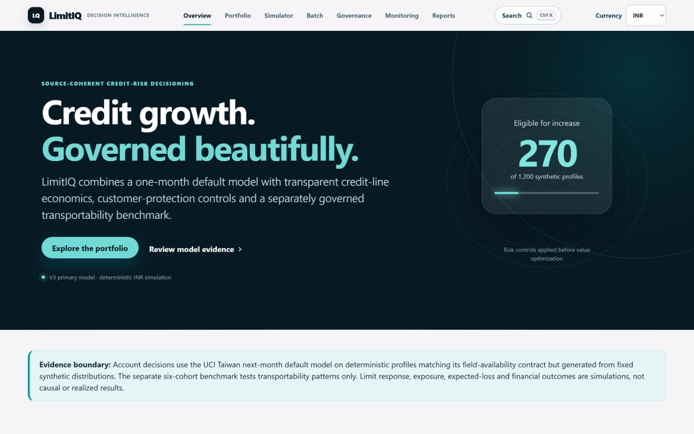
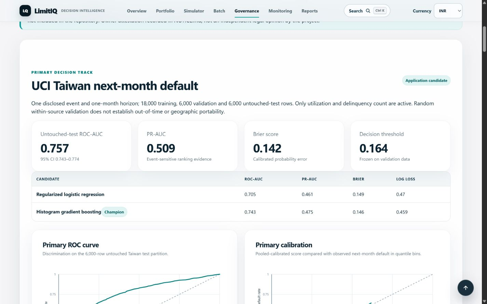

# LimitIQ

[](https://limitiq-credit-line-optimization.onrender.com)
[](https://github.com/Ghostboy789/limitiq-credit-line-optimization/actions/workflows/ci.yml)
[](https://github.com/Ghostboy789/limitiq-credit-line-optimization/actions/workflows/codeql.yml)
[](LICENSE)

**Governed credit-line decision support: coherent risk, constrained actions, transparent economics.**

LimitIQ evaluates +10%, +20%, +30%, hold, manual-review and early-warning-freeze
actions for existing credit-card customers. It combines a calibrated next-month
default model, deterministic candidate-limit optimization, customer-protection
rules and a recruiter-ready banking workflow in one Dockerized FastAPI service.

> LimitIQ is an educational portfolio demonstration using public and synthetic
> data. It is not a production credit-decision system and must not be used to
> make real lending decisions.

## Review this project in five minutes

1. [Executive overview](https://limitiq-credit-line-optimization.onrender.com/) — portfolio posture and simulated economics.
2. [Portfolio explorer](https://limitiq-credit-line-optimization.onrender.com/portfolio) — filters, reason codes and account traceability.
3. [Policy simulator](https://limitiq-credit-line-optimization.onrender.com/simulator) — baseline-versus-scenario trade-offs.
4. [Model governance](https://limitiq-credit-line-optimization.onrender.com/governance) — primary evidence, independent challenge and research benchmark.
5. [Recruiter brief](docs/RECRUITER_BRIEF.md) — interview narrative, résumé bullets and role fit.

## Product preview





[View the 390 px mobile capture](docs/assets/v3-overview-mobile.png) · [View the governance verdict](docs/assets/v3-governance.png)

The public deployment currently serves verified **v2.1.0**. The repository
contains the **v3.0.0 release candidate** described below; it is not called live
until CI, Render and production workflow verification pass.

Current local v3 gate: **112 tests passed at 72.82% coverage**; Ruff, formatting,
Bandit, dependency audit, source/demo/SBOM checks and local runtime smoke passed.
Docker/Trivy, GitHub Actions and production verification remain pending.
Coverage measures the primary/runtime package and explicitly omits the large
offline multi-source and external-validation CLIs; their committed evidence is
checked by artifact, provenance and schema tests rather than included in the headline.

## The senior-level design decision

V3 separates two model tracks that v2 had combined:

| Track | Purpose | Data and target | Decision use |
|---|---|---|---|
| **Primary** | Source-coherent application candidate | UCI Taiwan, 30,000 accounts, default in the following month | Drives only the educational synthetic demo |
| **Research** | Cross-source transportability benchmark | 1,869,548 rows, six independent cohorts with different events and horizons | Governance evidence only; never drives account recommendations |

This avoids pretending that heterogeneous public labels form one regulatory PD.
The primary model still does **not** establish Indian-market, out-of-time,
production, regulatory or fair-lending suitability.

## Exact primary-model evidence

Model: `limitiq-primary-3.0.0-89f9a2530bde`

Champion: sigmoid-calibrated histogram gradient boosting

Split: 18,000 train / 6,000 validation / 6,000 untouched test

Active fields: delinquency count and utilization; protected attributes excluded

| Untouched-test metric | Result | Seeded 95% bootstrap interval |
|---|---:|---:|
| ROC-AUC | **0.757410** | 0.743319–0.773753 |
| PR-AUC | **0.508729** | 0.480370–0.542755 |
| Brier score | **0.141683** | 0.136133–0.146975 |
| Log loss | **0.447444** | 0.433312–0.460640 |

Threshold `0.163964` was frozen from validation data before the single test-set
evaluation. The random within-source split is interpolation evidence, not a
future-vintage study.

The separate global research benchmark records source-macro ROC-AUC `0.684530`,
PR-AUC `0.402370`, Brier `0.138968` and log loss `0.433385`. Pooled results are
secondary because Lending Club dominates the row count and source outcomes are
not equivalent.

## Simulated portfolio outcome

The v3 demo contains 1,200 deterministic **synthetic profiles** that match the
Taiwan field-availability contract but use fixed simulated distributions. No
public source row or personal identifier is exposed.

| Scenario result | Simulated value |
|---|---:|
| Current / proposed limits | ₹514.951M / ₹566.423M |
| Current / proposed exposure proxy | ₹461.467M / ₹500.086M |
| Current / proposed loss proxy | ₹53.140M / ₹55.904M |
| Eligible increases | 270 profiles |
| Manual review / freeze | 323 / 56 profiles |
| Incremental contribution | **₹9.100M** |
| Contribution / incremental exposure | **23.56%** |

These are deterministic scenario outputs under disclosed LGD, CCF, response,
revenue and cost assumptions. They are not observed uplift, causal estimates,
realized profit, IFRS 9 ECL or regulatory capital.

## Product workflows

- Executive exposure, loss, contribution, action and early-warning view
- Searchable, sortable, filterable portfolio with safe CSV export
- Account decision with synthetic history, policy checks and reason codes
- Interactive policy/economics simulator with baseline deltas
- Strict transient batch scoring: 5 MB / 5,000 rows, no retention
- Two-track model governance, calibration, source stability and limitations
- Printable credit-committee memo and downloadable evidence
- `/health`, `/live`, `/ready` and aggregate-only `/ops` operational endpoints
- INR-native simulation with presentation-only USD/EUR display conversion

## Decision logic

For each profile, the optimizer evaluates the current line and +10%, +20%, +30%
candidates, then maximizes simulated risk-adjusted contribution subject to:

- maximum increase, account exposure and portfolio growth caps
- expected-loss and profitability hurdles
- delinquency and payment-history eligibility
- overextension safeguards
- manual-review and early-warning routing
- application-level rollback via `AUTO_INCREASES_ENABLED=false`

Expected loss proxy is `score × LGD × EAD`. Incremental contribution is simulated
interchange + interest − incremental loss − funding − capital − servicing cost.
No automatic punitive line decrease is recommended.

## Architecture


One Python process; no SPA, database service, feature store, LLM, paid API or
runtime network dependency. Repository-built model bytes are checksum-verified
before deserialization.

## Reproduce locally

Python 3.11–3.13 is supported; CI and Docker use Python 3.11.

```bash
python -m venv .venv
# Windows PowerShell: .venv\Scripts\Activate.ps1
# Linux/macOS: source .venv/bin/activate
python -m pip install -r requirements-dev.txt
python -m uvicorn limitiq.web:app --host 127.0.0.1 --port 8000
```

Prepared application artifacts are committed. Full raw datasets remain
gitignored.

```bash
# Inspect the source manifest and committed analytics/SBOM evidence
python -m limitiq.sources manifest
python -m limitiq.analytics --check
python -m limitiq.sbom --check sbom/limitiq.cdx.json

# After obtaining the gitignored raw sources, verify every checksum
python -m limitiq.sources verify

# Rebuild coherent primary artifacts from the cached UCI source
python -m limitiq.sources fetch-open
python -m limitiq.primary

# Exercise training code without raw data or release writes
python -m limitiq.primary --smoke

# Rebuild the research benchmark from existing gitignored sources
python -m limitiq.multisource
python -m limitiq.evidence

# Quality gates
python -m pytest --cov=limitiq --cov-report=term-missing
ruff check .
ruff format --check .
bandit -q -r limitiq
pip-audit -r requirements.txt
```

```bash
docker build -t limitiq .
docker run --rm -p 8000:8000 limitiq
```

## Engineering, security and operations evidence

- Pinned runtime and development dependencies
- Deterministic source manifest with URLs, licence/terms, hashes and row counts
- CycloneDX 1.6 direct-dependency [SBOM](sbom/limitiq.cdx.json)
- Release [SHA-256 manifest](release/checksums-v3.0.0.sha256) covering the
  primary model, metadata, schema, evidence, demo portfolio and SBOM
- GitHub Actions for tests, coverage, Ruff, Bandit, dependency/secret scanning,
  Docker build, Trivy image scan, health and concurrency smoke
- Separate CodeQL workflow and Dependabot configuration
- CSP, HSTS, frame denial, nosniff, permissions/referrer/opener headers
- Formula-safe CSV export, allowlisted report paths and bounded validated uploads
- Non-root one-worker container, kill switch, request IDs and server timing
- Minimal SQLite [decision mart](analytics/README.md) that reconciles the primary
  synthetic portfolio without adding a runtime database

## Governance package

- [Recruiter brief](docs/RECRUITER_BRIEF.md)
- [Independent validation-style review](docs/INDEPENDENT_VALIDATION.md)
- [Validation issue ledger](docs/VALIDATION_ISSUES.md)
- [Model and decision-component inventory](docs/MODEL_INVENTORY.md)
- [Randomized pilot design](docs/EXPERIMENT_DESIGN.md)
- [India readiness assessment](docs/INDIA_READINESS.md)
- [Model card](docs/MODEL_CARD.md) and [data card](docs/DATA_CARD.md)
- [Methodology](docs/METHODOLOGY.md), [PRD](docs/PRD.md), [architecture](docs/ARCHITECTURE.md)
- [Career targeting guide](docs/CAREER_TARGETING.md)
- [Dataset attribution and terms record](NOTICE.md)

The validation review is validation-**style**, not organizationally independent
bank validation. Publication clearance for four research sources relies on the
repository owner's dated attestation and is not an independent legal opinion.

## Known limitations and next steps

- Primary source is Taiwan, 2005; India and temporal portability are unproven.
- Primary evidence uses a random within-source split, not a mature future vintage.
- Only utilization and delinquency count are active in the harmonized primary contract.
- No dataset observes treatment response to a limit increase.
- Fairness diagnostics cannot establish jurisdiction-specific legal compliance.
- Monitoring thresholds are illustrative; no live outcome feed exists.
- The multi-source benchmark has heterogeneous targets and weak source cohorts.

The correct next step is representative local data, a future-vintage holdout,
organizationally independent validation and a governed randomized pilot—not a
larger decorative model.

## Release history

- **v3.0.0 release candidate:** coherent primary model, research separation,
  confidence intervals, validation package, committee memo, SQL/SBOM/ops gates.
- **v2.1.0:** verified live application and multi-source research benchmark.
- **v1.0.0:** archived Taiwan-only original pipeline.

Code is [MIT licensed](LICENSE). Dataset terms differ by source; MIT does not
relicense third-party data or derived-artifact rights.
