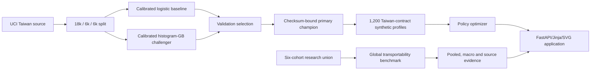

# Architecture

## Runtime

One Python 3.11 process serves FastAPI routes and Jinja templates, loads a
checksum-bound sklearn pipeline and prepared synthetic portfolio, and runs the
deterministic optimizer. There is no SPA, database, queue, feature store, LLM or
paid API. Charts are server-side SVG and compatible with the restrictive CSP.

## V3 data and model flow

The primary model uses only delinquency count and utilization from one coherent
source and target. The research harmonizers share six narrow proxies plus region
context; source identification can occur through region and missingness. Both
tracks use random within-source splits, so neither tests future vintages or
unseen markets.

## Trust boundaries

- Raw datasets are local and gitignored.
- Every source and model artifact is SHA-256 bound.
- Statlog German is reference-only to prevent duplicate-population leakage.
- Model loading verifies the expected checksum before trusted joblib loading.
- The request body is bounded before multipart parsing; CSV content is then
  row/schema/range bounded, processed transiently and never deserialized as an
  object or retained. Framework-managed temporary spooling may occur.
- Sort/report/document paths are allowlisted.
- Jinja autoescape and CSP/security headers are enabled; production debug is off.
- Synthetic `LIQ-*` IDs and profiles prevent source-ID exposure.

## Deployment boundary

The public Render service serves verified v3.0.1. The annotated release tag is
the immutable revision and live `/health` exposes the exact deployed commit.
CI, CodeQL, container security, production workflows and 1440/768/390 px
browser QA passed on 21 August 2026. Research-source publication proceeds under the
repository owner's 14 August 2026 resolution attestation in `NOTICE.md`; this
record is not an independent legal opinion.

## Failure behavior and rollback

`AUTO_INCREASES_ENABLED=false` is the application-level rollback control. It
routes otherwise eligible increases to manual review, updates the demonstration
summary, applies to API/batch/simulator decisions and is visible in `/health`.

Missing or checksum-invalid model artifacts fail startup. Invalid uploads return
bounded safe errors. Unknown/insufficient profiles route to manual review or
freeze rather than automatic increase. Rollback disables automatic increases or
restores the prior checksum-verified application release.
