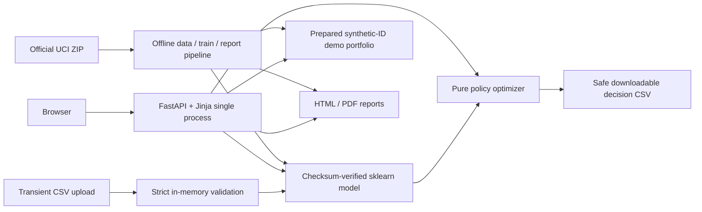

# Architecture

## Shape

One Python 3.12 process serves FastAPI routes and Jinja templates, loads a
checksum-verified sklearn pipeline and a prepared 6,000-row demonstration CSV at
startup, and evaluates a pure deterministic policy optimizer. There is no SPA,
database service, queue, feature store, LLM or external runtime API.

## Offline pipeline

`python -m limitiq.pipeline all` downloads the official ZIP with a size/safe-path
guard, records checksum/licence/source, validates and cleans the XLS, engineers
features inside sklearn, creates fixed stratified splits, calibrates/selects two
models on train/validation, evaluates untouched test once, saves artifacts,
creates the demo portfolio and builds reports.

## Runtime

`uvicorn limitiq.web:app` verifies the trusted joblib checksum before loading it.
The prepared portfolio contains no original ID or demographics. Explorer
queries are pandas filters with regex escaping and allowlisted sorts. Simulator
reuses stored PD and recomputes pure policy/economics—no retraining or hidden
state. Batch uploads are size-capped, read once into memory, schema/range checked,
scored and immediately returned with `no-store`.

## Security boundary

The only deserialized model is repository-built and checksum-verified. Uploaded
files are CSV, never joblib/pickle. Report/document paths use slug allowlists.
Jinja autoescapes source values. Exports neutralize spreadsheet-formula prefixes.
The app adds CSP, frame denial, nosniff, referrer, permissions and opener headers.
It has no persistent mutation, session or authentication surface.

## Deployment

The non-root Docker image runs one worker, limits numerical-library threads and
ships only runtime code, trusted artifacts, demo data, docs and reports. A stdlib
health check probes `/health`. Render configuration uses a free Docker web
service and deploy-after-checks behavior. Production never downloads or trains.

