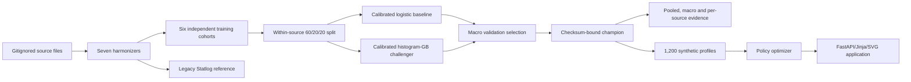

# Architecture

## Runtime

One Python 3.11 process serves FastAPI routes and Jinja templates, loads a
checksum-bound sklearn pipeline and prepared synthetic portfolio, and runs the
deterministic optimizer. There is no SPA, database, queue, feature store, LLM or
paid API. Charts are server-side SVG and compatible with the restrictive CSP.

## Local v2 data and model flow

The harmonizers share six narrow numeric proxies plus region context. Source
identification can still occur through region and missingness. The split is
random within source, so it does not test future vintages or unseen markets.

## Trust boundaries

- Raw datasets are local and gitignored.
- Every source and model artifact is SHA-256 bound.
- Statlog German is reference-only to prevent duplicate-population leakage.
- Model loading verifies the expected checksum before trusted joblib loading.
- Uploaded CSV is size/row/schema/range bounded, processed in memory and never
  deserialized as an object or retained.
- Sort/report/document paths are allowlisted.
- Jinja autoescape and CSP/security headers are enabled; production debug is off.
- Synthetic `LIQ-*` IDs and profiles prevent source-ID exposure.

## Deployment boundary

The public Render service is verified v1. Local v2 publication is blocked until
terms review clears Give Me Some Credit, FICO/HELOC, Lending Club upstream and
Home Credit. Architecture readiness is not publication authorization.

## Failure behavior and rollback

Missing or checksum-invalid model artifacts fail startup. Invalid uploads return
bounded safe errors. Unknown/insufficient profiles route to manual review or
freeze rather than automatic increase. Rollback restores the prior verified v1
artifact or disables automatic increases.
